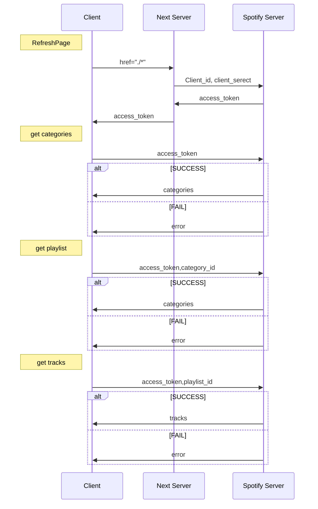

## APIs UML

```mermaid
sequenceDiagram

    note left of Client: RefreshPage
    Client->>Next Server: href="./*"
    Next Server->>Spotify Server: Client_id, client_serect
    Spotify Server->>Next Server: access_token
    Next Server->>Client: access_token

    note left of Client: get categories
    Client->>Spotify Server: access_token
    alt SUCCESS
        Spotify Server->>Client: categories
    else FAIL
        Spotify Server->>Client: error
    end

    note left of Client: get playlist
    Client->>Spotify Server: access_token,category_id
    alt SUCCESS
        Spotify Server->>Client: categories
    else FAIL
        Spotify Server->>Client: error
    end

    note left of Client: get tracks
    Client->>Spotify Server: access_token,playlist_id
    alt SUCCESS
        Spotify Server->>Client: tracks
    else FAIL
        Spotify Server->>Client: error
    end
```
