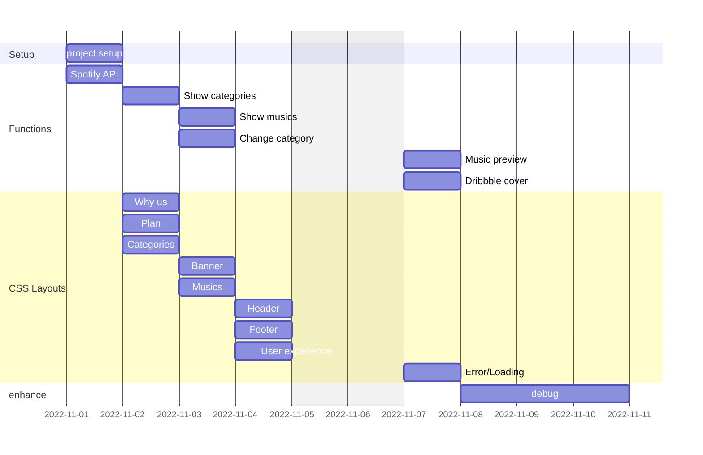

## Requirement

-  Setup
    - [X] nextjs + react
    - [X] redux
    - [X] redux-saga
    - [X] eslint
    - [X] styled-components
    - [X] next-i18next
    - [X] documents

- CSS Layouts
    - [X] Header
    - [X] Banner
    - [X] Musics
    - [X] Categories
    - [X] Why us
    - [X] Plan
    - [X] User experience
    - [X] Footer
    - [X] Error/Loading

- Functions
    - [X] Spotify API
    - [X] Show categories
    - [X] Show musics
    - [X] Change category
    - [X] Music preview
    - [X] Dribbble cover

## Gantt

